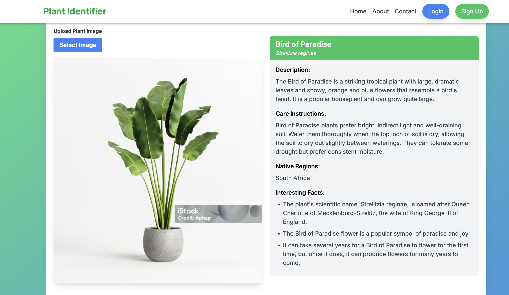

# Plant Identifier - Next.js SaaS Starter Template



This repository is a Next.js SaaS starter template integrated with Supabase for authentication, featuring a contact form, about page, and a sample implementation of a plant identifier tool using AI.

## Features

- **Next.js 13**: The latest version of Next.js for fast and scalable web applications.
- **Supabase Authentication**: Easy to use and scalable authentication with Supabase.
- **AI-Powered Plant Identifier**: Identify plants using advanced AI algorithms.
- **Responsive Design**: Fully responsive design using Tailwind CSS.
- **Feature Cards**: Showcase key features of your application.
- **Contact Form**: Collect user queries with a fully functional contact form.
- **About Page**: Informative about page to describe your application.

## Getting Started

### Prerequisites

Ensure you have the following installed:

- Node.js (v14 or later)
- npm or yarn
- Supabase account

### Installation

1. **Clone the repository**:

   ```sh
   git clone https://github.com/your-username/plant-identifier.git
   cd plant-identifier
   ```

2. **Install dependencies**:

   ```sh
   npm install
   # or
   yarn install
   ```

3. **Set up Supabase**:

   - Create a new project in Supabase.
   - Note the Supabase URL and API key.
   - Create the necessary tables using the SQL provided below.

4. **Create `.env.local` file**:

   ```sh
   NEXT_PUBLIC_SUPABASE_URL=your-supabase-url
   NEXT_PUBLIC_SUPABASE_ANON_KEY=your-supabase-anon-key
   NEXT_PUBLIC_GOOGLE_GEMINI_API_KEY=your-google-gemini-api-key
   NEXT_PUBLIC_GOOGLE_GEMINI_MODEL=your-google-gemini-model
   ```

5. **Set up the database**:

   - Navigate to the SQL Editor in the Supabase dashboard.
   - Run the following SQL to create the `queries` table:

   ```sql
   CREATE TABLE public.queries (
     id SERIAL PRIMARY KEY,
     name TEXT NOT NULL,
     email TEXT NOT NULL,
     message TEXT NOT NULL,
     created_at TIMESTAMP WITH TIME ZONE DEFAULT CURRENT_TIMESTAMP
   );
   ```

   - Enable Row Level Security (RLS) and add the appropriate policies.

### Running the Project

1. **Development server**:

   ```sh
   npm run dev
   # or
   yarn dev
   ```

2. **Open your browser**:
   Navigate to `http://localhost:3000` to see the application in action.

### Project Structure

- **components/**: Reusable React components such as `FeatureCard`, `ImageUpload`, and `ContactForm`.
- **pages/**: Next.js pages including `index.tsx`, `about.tsx`, and `contact.tsx`.
- **lib/**: Supabase client setup.
- **redux/**: Redux store and slices for state management.
- **styles/**: Global CSS and Tailwind CSS configuration.

### Screenshots

#### Home Page


## Usage

### AI-Powered Plant Identifier

- Upload an image of a plant.
- Click "Identify Plant" to get the plant's information using AI.
- The plant information, including care instructions and interesting facts, will be displayed on the right.

### Contact Form

- Navigate to the Contact page.
- Fill in the form with your name, email, and message.
- Submit the form to send your query to the Supabase database.

### About Page

- Navigate to the About page to learn more about the application and its features.

## Contributing

Contributions are welcome! Please fork the repository and submit a pull request for any enhancements or bug fixes.

## License

This project is licensed under the MIT License. See the LICENSE file for more details.

## Acknowledgements

- [Next.js](https://nextjs.org/)
- [Supabase](https://supabase.io/)
- [React Icons](https://react-icons.github.io/react-icons/)
- [Tailwind CSS](https://tailwindcss.com/)
